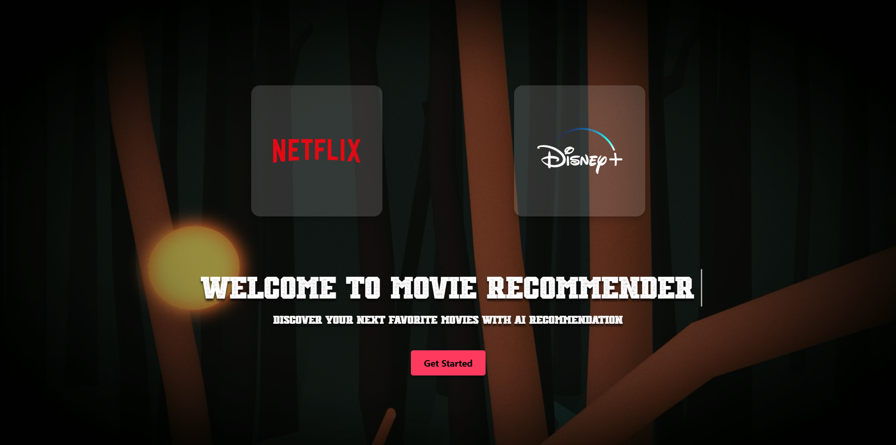
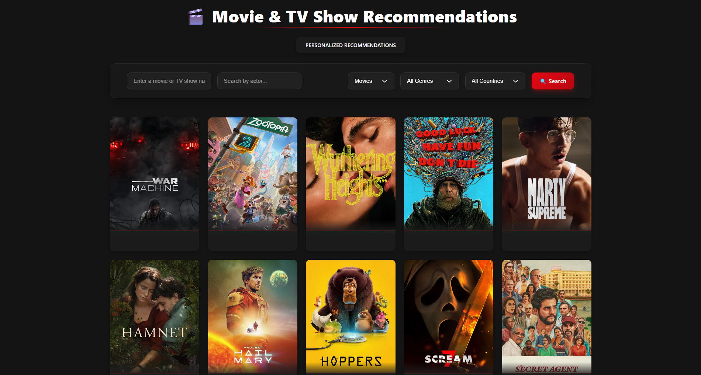
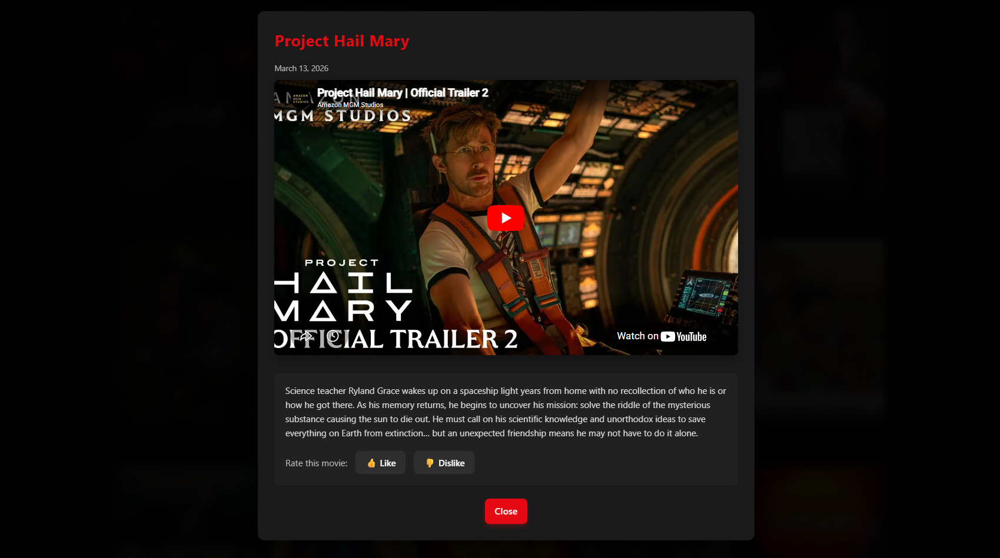

### Movie Recommender – React + TypeScript + Vite

Application web de recommandation de films et séries basée sur l’API TMDB.  
L’utilisateur peut :
- rechercher des films / séries par titre,
- rechercher un acteur et voir ses meilleurs films,
- liker / disliker des contenus pour construire des préférences,
- générer des recommandations personnalisées en fonction de ses goûts.

---
## 📸 Screenshots



### Table des matières

- [Description](#description)
- [Badges](#badges)
- [Fonctionnalités](#fonctionnalités)
- [Prérequis](#prérequis)
- [Installation](#installation)
- [Configuration](#configuration)
- [Utilisation / Démarrage](#utilisation--démarrage)
- [Structure du projet](#structure-du-projet)
- [API / Endpoints](#api--endpoints)
- [Tests](#tests)
- [Déploiement](#déploiement)
- [Contribution](#contribution)
- [Licence](#licence)

---

### Description

Ce projet est une SPA (Single Page Application) front-end construite avec **React 19**, **TypeScript** et **Vite**.  
Elle consomme l’API publique de **The Movie Database (TMDB)** pour :
- afficher les tendances du moment,
- permettre la recherche avancée (titre, type, pays, genre),
- proposer des recommandations personnalisées basées sur les likes/dislikes et les acteurs préférés.

L’interface met l’accent sur une expérience immersive avec :
- une page d’accueil animée (vidéo de fond + animations Lottie),
- une page de recommandation riche en filtres et en interactions.

---

### Badges

> À adapter selon votre projet (exemple) :

- Version du projet : **0.0.0**
- Build tool : **Vite 6**
- Langage : **TypeScript 5**
- Framework : **React 19**

---

### Fonctionnalités

- **Recherche de contenus** : films, séries ou les deux via l’API TMDB.
- **Filtrage avancé** :
  - par type (`movie`, `tv`, `multi`),
  - par genre,
  - par pays / région.
- **Recherche par acteur** :
  - suggestion d’acteurs,
  - affichage de la filmographie (meilleurs films).
- **Recommandations personnalisées** :
  - mémorisation des likes/dislikes par film,
  - apprentissage des genres / acteurs préférés,
  - génération de recommandations via l’endpoint `discover`.
- **Gestion des préférences** :
  - stockage dans `localStorage`,
  - bouton de reset complet des préférences.
- **UI moderne et animée** :
  - page d’accueil avec vidéo plein écran,
  - animations Lottie,
  - layout responsive.

---

### Prérequis

- **Node.js** : version **>= 18** recommandée.
- **npm** : version **>= 9** (installé avec Node).
- Un compte **TMDB** pour obtenir une clé d’API.

---

### Installation

Cloner le dépôt (ou placer le projet sur votre machine), puis :

```bash
cd frontend
npm install
```

Cela installe toutes les dépendances définies dans `package.json` :
- `react`, `react-dom`, `react-router-dom`
- `axios`, `lottie-react`, `@splinetool/react-spline`
- Outils de build et qualité : `vite`, `typescript`, `eslint`, `tailwindcss` (config partielle), etc.

---

### Configuration

#### Variables d’environnement

Le projet utilise l’API TMDB. Pour cela, une clé doit être fournie via les variables d’environnement Vite.

Fichier `.env` à la racine du projet :

```env
VITE_TMDB_API_KEY=your_tmdb_api_key_here
```

Dans le code actuel, certaines clés TMDB sont encore écrites en dur dans `src/App.tsx` et `src/RecommendationPage.tsx`.  
Pour une configuration plus propre en production, il est recommandé de :
- supprimer les clés en clair,
- utiliser `import.meta.env.VITE_TMDB_API_KEY` au lieu d’une string codée en dur.

> Attention : ne jamais committer de clé d’API réelle dans un dépôt public.

---

### Utilisation / Démarrage

Depuis la racine du projet (`frontend`) :

```bash
# Démarrage en mode développement
npm run dev

# (alternatif / hérité) script create-react-app
npm start

# Build de production
npm run build

# Prévisualisation du build
npm run preview

# Lint du projet
npm run lint
```

Par défaut, Vite démarre le serveur sur `http://localhost:5173` (indiqué dans le terminal).

---

### Structure du projet

Arborescence simplifiée :

```text
frontend/
  ├─ public/
  │   └─ placeholder-actor.png
  ├─ src/
  │   ├─ main.tsx            # Point d’entrée React, montage sur #root
  │   ├─ App.tsx             # Définition des routes et logique de recommandation principale
  │   ├─ LandingPage.tsx     # Page d’accueil (vidéo + animations Lottie)
  │   ├─ RecommendationPage.tsx
  │   │                      # Page alternative centrée sur la recherche d’acteurs
  │   ├─ LottieAnimation.tsx # Wrapper générique pour les animations Lottie
  │   ├─ *.css               # Styles modulaires (landing, recommandations, navigation…)
  │   └─ index.css           # Styles globaux de base
  ├─ index.html              # Shell HTML Vite, charge main.tsx
  ├─ vite.config.ts          # Configuration Vite + plugin React SWC
  ├─ package.json            # Dépendances et scripts npm
  ├─ .env                    # Variables d’environnement (non commit en prod)
  └─ README.md               # Ce fichier
```

Architecture générale :
- **Frontend uniquement** : pas de backend dans ce repo.
- **Client React** : la logique d’appel API et de recommandations est côté client.
- **Stockage local** : `localStorage` pour les préférences utilisateurs (genres/acteurs, likes/dislikes).

---

### API / Endpoints

Le projet communique directement avec l’API TMDB (côté navigateur).  
Principaux endpoints utilisés (côté client) :

- **Genres**
  - `GET https://api.themoviedb.org/3/genre/{type}/list`
  - Paramètres :
    - `type` : `movie` ou `tv`
    - `api_key`: clé d’API TMDB

- **Tendances**
  - `GET https://api.themoviedb.org/3/trending/{type}/day`
  - `GET https://api.themoviedb.org/3/trending/{type}/week`
  - Utilisé pour remplir la page de base et, si peu de préférences, les recommandations.

- **Recherche multi / film / série**
  - `GET https://api.themoviedb.org/3/search/multi`
  - `GET https://api.themoviedb.org/3/search/movie`
  - `GET https://api.themoviedb.org/3/search/tv`
  - Paramètres :
    - `api_key`, `query`, `page`
    - optionnels : `with_genres`, `region`

- **Recherche d’acteurs**
  - `GET https://api.themoviedb.org/3/search/person`
  - Paramètres :
    - `api_key`, `query`, `include_adult`

- **Crédits d’un acteur**
  - `GET https://api.themoviedb.org/3/person/{actor_id}/combined_credits`
  - `GET https://api.themoviedb.org/3/person/{actor_id}/movie_credits`

- **Vidéos / trailers**
  - `GET https://api.themoviedb.org/3/movie/{id}/videos`
  - `GET https://api.themoviedb.org/3/tv/{id}/videos`
  - Utilisé pour trouver une bande-annonce YouTube (priorité à “official trailer”).

- **Découverte / recommandations**
  - `GET https://api.themoviedb.org/3/discover/{type}`
  - Paramètres :
    - `api_key`, `sort_by=popularity.desc`
    - `with_genres` : genres les plus likés
    - `region` : pays choisi.

> Remarque : toutes les requêtes incluent la clé `api_key` qui doit venir de votre configuration (`.env` / `import.meta.env`).

---

### Tests

Aucun script de test spécifique n’est défini actuellement dans `package.json`.  
Pour ajouter des tests, vous pouvez par exemple :
- intégrer **Vitest** + **React Testing Library** pour les tests unitaires,
- ajouter un script `test` dans `package.json` :

```json
"scripts": {
  "test": "vitest"
}
```

Puis :

```bash
npm run test
```

---

### Déploiement

#### Build de production

```bash
npm run build
```

Cela génère un bundle optimisé dans le dossier `dist/`.

#### Hébergement

Le projet est une application front-end statique et peut être déployé sur :
- **Vercel**
- **Netlify**
- **GitHub Pages**
- ou tout serveur HTTP statique (Nginx, Apache, S3 + CloudFront, etc.).

Étapes génériques :
1. Construire le projet : `npm run build`
2. Déployer le contenu de `dist/` sur votre plateforme d’hébergement.
3. Configurer, si besoin, le fallback pour les routes SPA (toutes les routes renvoient vers `index.html`).

---

### Contribution

1. **Fork** du dépôt.
2. Créez une branche de fonctionnalité :  
   `git checkout -b feature/ma-fonctionnalite`
3. Faites vos modifications (en respectant le style de code existant).
4. Lancez les commandes basiques :  
   `npm run lint` et (si ajoutés) `npm run test`.
5. Poussez votre branche et ouvrez une **Pull Request** avec une description claire.

---

### Licence

Le projet n’indique pas encore explicitement de licence.  
Si vous le partagez publiquement, vous pouvez par exemple ajouter une licence MIT en créant un fichier `LICENSE` à la racine.
